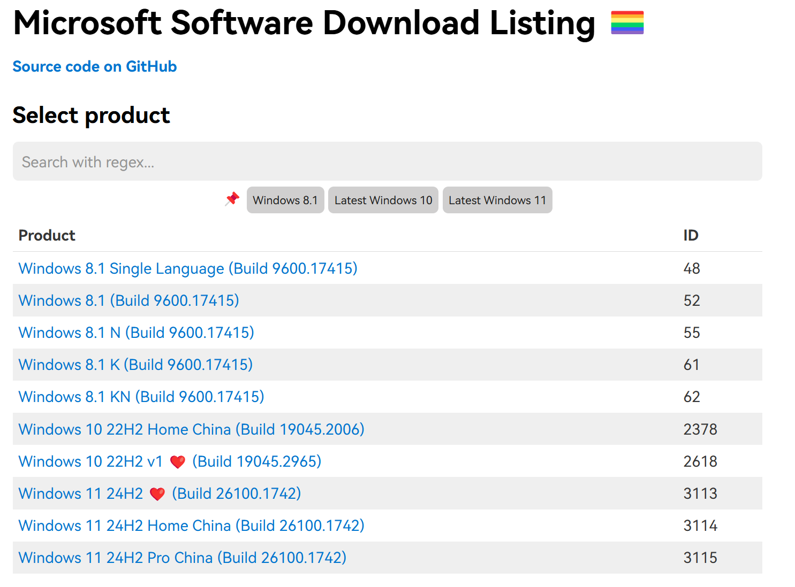
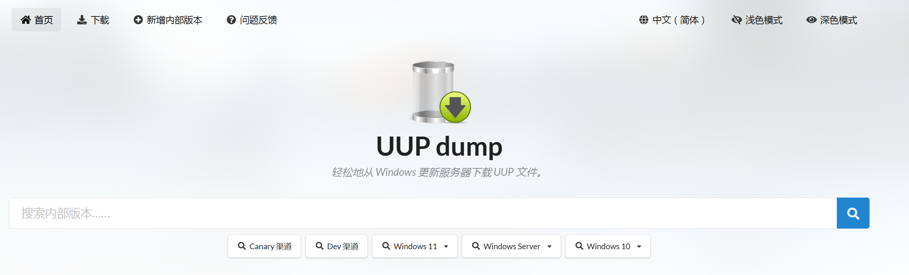

### 原版微软系统

1. Microsoft Software Download Listing https://msdl.gravesoft.dev/


2. UUP dump https://www.uupdump.cn/ 推荐使用使用了多线程


### 第三方修改的微软系统(要付费)

- 不忘初心系统 https://www.pc528.net/


### 系统激活网站

- Microsoft Activation Scripts (MAS) https://massgrave.dev/

1. 打开 PowerShell（不是 CMD）。要这样做，右键单击 Windows 开始菜单，然后选择 PowerShell 或终端。

2. 复制以下代码并按回车键

```
irm https://get.activated.win | iex 或 irm https://massgrave.dev/get | iex
```

3. 看到激活选项。选择[1] HWID 进行 Windows 激活。选择[2] Ohook 进行 Office 激活。